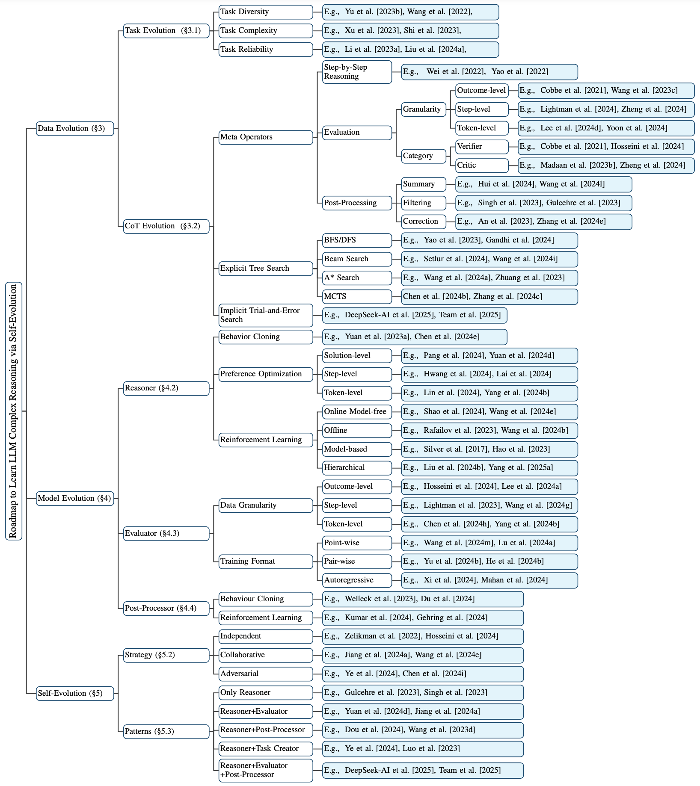

<div align="center">
<h2>
A Survey on Complex Reasoning of Large Language Models through the Lens of Self-Evolution
</h2>
</div>


<div align="center">
<b>Tao He</b><sup>1∗</sup>,
<b>Hao Li</b><sup>1∗</sup>,
<b>Jingchang Chen</b><sup>1</sup>,
<b>Runxuan Liu</b><sup>1</sup>,
<b>Yixin Cao</b><sup>2</sup>,
<b>Lizi Liao</b><sup>3</sup>,
<b>Zihao Zheng</b><sup>1</sup>,
<b>Zheng Chu</b><sup>1</sup>,
<b>Jiafeng Liang</b><sup>1</sup>,
<b>Ming Liu</b><sup>1†</sup>,
<b>Bing Qin</b><sup>1</sup>,
</div>

<div align="center">
<sup>1</sup>Harbin Institute of Technology, Harbin, China
</div>
<div align="center">
<sup>2</sup>Fudan University, Shanghai, China
</div>
<div align="center">
<sup>2</sup>Singpore Management University, Singapore
</div>
<div align="center">
    <!-- <a href="http://dx.doi.org/10.13140/RG.2.2.23943.30886"></a> -->
    <a href="https://github.com/cs-holder/Reasoning-Self-Evolution-Survey"></a>
    <a href="https://github.com/zchuz/CoT-Reasoning-Survey/blob/main/LICENSE">  </a>
</div>


This repository contains the resources for survey  paper **_A Survey on Complex Reasoning of Large Language Models through the Lens of Self-Evolution_**




For more details, please refer to the paper: [A Survey on Complex Reasoning of Large Language
Models through the Lens of Self-Evolution](https://github.com/cs-holder/Reasoning-Self-Evolution-Survey/blob/main/LLM_Self_Evolution_survey.pdf).

## 🎉 Updates

- 2025/02/26 We updated the paper by replacing the terminology for the two search methods, adding a table to summarize the comparison between the two search approaches, and refining the content of theory in self-evolution.
- 2025/02/24 We created this reading list repository.

This reading list will be updated periodically, and if you have any suggestions or find some we missed, feel free to contact us! You can submit an issue or send an email (the@ir.hit.edu.cn or haoli@ir.hit.edu.cn).


## 🎁 Resources

### Surveys

- **Navigate through Enigmatic Labyrinth A Survey of Chain of Thought Reasoning: Advances, Frontiers and Future**, ACL 2024 [[paper](https://arxiv.org/pdf/2309.15402v3)]
- **A Survey on Self-Evolution of Large Language Models**, arxiv.2404.14387 [[paper](https://arxiv.org/pdf/2404.14387)]
- **A Survey on Data Synthesis and Augmentation for Large Language Models**, arxiv.2410.12896 [[paper](https://arxiv.org/pdf/2410.12896)]
- **Reinforcement learning enhanced LLMs: A survey**, arxiv.2412.10400 [[paper](https://arxiv.org/pdf/2412.10400)]
- **Automatically Correcting Large Language Models: Surveying the Landscape ofDiverse Automated Correction Strategies**, TACL [[paper](https://aclanthology.org/2024.tacl-1.27.pdf)]
- **When Can LLMs Actually Correct Their Own Mistakes? A Critical Survey of Self-Correction of LLMs**, TACL [[paper](https://watermark.silverchair.com/tacl_a_00713.pdf?token=AQECAHi208BE49Ooan9kkhW_Ercy7Dm3ZL_9Cf3qfKAc485ysgAAA0kwggNFBgkqhkiG9w0BBwagggM2MIIDMgIBADCCAysGCSqGSIb3DQEHATAeBglghkgBZQMEAS4wEQQM3W1Jn5YKDVaTagI5AgEQgIIC_NQ1C11SfqRawn6tF1gUf5aOi-XmdZeaSI_2J-kjPOa0HLCgnV93IWGjrbLgRguBq2QqVWuPcjKld0SAakwctOBUzZAvmMxocTtH8BGKl9Dpdcwz06cbT12KQlsQvtazUew0fNcm7NsCIKeyv7PlJc9QlHY0xPoJEVFXhdI0vbDT_Gy0tiUO6XvWxlTjbM3kzZffIxZ3v8pyZAI0iOmU1pnxC15QJkEb91Bol49Biho2Eg6LFVW_5Z_LUcAcEU7ENYpTsViNNoVI41ZIw4baMwifDZxQfb_RXmXjfBRbAaZR3uAGaZm031klu6dzcmK2i_FlrxBO7fJKciv_PG1YwQN5cflDbb3LWP19X26ZpWvmwgCfeN4ARHRtGFiOpEDWGSnLsws_fRBjvmvNnanlobz_2vKQfex-94HRHgmC9NTvDJb_3QTZ8xyGyvXbCJ-gllk35chKO91db4wE3X57pkaM_vZBIIH5wN5-F4bX-OPf_TgJXX6d052osbXglNBZKqGHR_moQGGiXH2wvP1Y-ljQdlQLHlcruwp3fe17NoEi8VkCmqpanKR3XAEv8EJREvvn1Nh5_nvCku1ONTuVUQzW4xlwHor5-VZtVR-Wpurbn--cFF-RvtcGZnbmpCluepLAt8JY0Dzu0Q7xrSIlCpDC39lJXLnWGFjWHtvlF1OMOBgNkfHAv3mQpVnfch7V3JpWtQJt1qUfVR5HTWfMb7LmkK9TVR7Uq2Hb0bJMhLUDju3z16GfCLq0z-xrryR7wmpPyknXu-Ond7gHEgagSc7UvaQ0xgBxQekJ5vMTi3ALbH0q1jB6790bBm642SOQKEnO9cW07zGLl5zDklySVwq0HlBHzkqVrH2G4yO4ifSl08DBi4sJiBQUCAMFEzSc_AXrVR1wItieftpSoxc7XdXrtl1LHSNMVB0e0w3qYXEF-kZvDmO0tndGDrQLXUtJtT-PlM08iokYzx4pM1KjZjW_KCrgpEIEGWCl7F4k9U0P861arEayvTl7RNfM)]

### Projects

- **HqWu-HITCS/Awesome-LLM-Survey**, [[project](https://github.com/HqWu-HITCS/Awesome-LLM-Survey)]
- **AGI-Edgerunners/LLM-Planning-Papers** [[project](https://github.com/AGI-Edgerunners/LLM-Planning-Papers)]
- **modelscope/awesome-deep-reasoning** [[project](https://github.com/modelscope/awesome-deep-reasoning)]
- **wasiahmad/Awesome-LLM-Synthetic-Data** [[project](https://github.com/wasiahmad/Awesome-LLM-Synthetic-Data)]
- **CSHaitao/Awesome-LLMs-as-Judges** [[project](https://github.com/CSHaitao/Awesome-LLMs-as-Judges)]

## 🚀 Data Evolution


### Task Evolution

- **Common 7B Language Models Already Possess Strong Math Capabilities**, arXiv.2403.04706 [[paper](https://arxiv.org/pdf/2403.04706)]
- **Language Models Can Teach Themselves to Program Better**, ICLR 2023 [[paper](https://openreview.net/forum?id=SaRj2ka1XZ3)]
- **Learning Performance-Improving Code Edits**, ICLR 2024 [[paper](https://openreview.net/forum?id=ix7rLVHXyY)]
- **MetaMath: Bootstrap Your Own Mathematical Questions for Large Language Models**, ICLR 2024 [[paper](https://openreview.net/forum?id=N8N0hgNDRt)]
- **TinyGSM: achieving >80\% on GSM8k with small language models**, arxiv.2312.09241 [[paper](https://arxiv.org/abs/2312.09241)]
- **WizardLM: Empowering Large Language Models to Follow Complex Instructions**, ICLR 2024 [[paper](https://openreview.net/forum?id=CfXh93NDgH)]
- **Self-Instruct: Aligning Language Models with Self-Generated Instructions**, ACL 2023 [[paper](https://doi.org/10.18653/v1/2023.acl-long.754)]
- **Large Language Models Can Be Easily Distracted by Irrelevant Context**, ICML 2023 [[paper](https://proceedings.mlr.press/v202/shi23a.html)]
- **Orca-Math: Unlocking the potential of SLMs in Grade School Math**, arxiv.2402.14830 [[paper](https://arxiv.org/abs/2402.14830)]
- **Self-Alignment with Instruction Backtranslation**, ICLR 2024 [[paper](https://openreview.net/forum?id=1oijHJBRsT)]
- **Augmenting Math Word Problems via Iterative Question Composing**, arXiv.2401.09003 [[paper](https://arxiv.org/abs/2401.09003)]
- **Generating Symbolic Reasoning Problems with Transformer GANs**，arxiv.2110.10054 [[paper](https://arxiv.org/abs/2110.10054)]
- **Magicoder: Empowering Code Generation with OSS-Instruct**, ICML 2024 [[paper](https://openreview.net/forum?id=XUeoOBid3x)]
- **MathGenie: Generating Synthetic Data with Question Back-translation for Enhancing Mathematical Reasoning of LLMs**, ACL 2024 [[paper](https://doi.org/10.18653/v1/2024.acl-long.151)]

### CoT Evolution

#### Step-by-Step Reasoning

- **Chain-of-Thought Prompting Elicits Reasoning in Large Language Models**, NeurIPS 2022 [[paper](http://papers.nips.cc/paper_files/paper/2022/hash/9d5609613524ecf4f15af0f7b31abca4-Abstract-Conference.html)]
- **Plan-and-Solve Prompting: Improving Zero-Shot Chain-of-Thought Reasoning by Large Language Models**, ACL 2023 [[paper](https://doi.org/10.18653/v1/2023.acl-long.147)]
- **Least-to-Most Prompting Enables Complex Reasoning in Large Language Models**, ICLR 2023 [[paper](https://openreview.net/forum?id=WZH7099tgfM)]
- **Successive Prompting for Decomposing Complex Questions**, EMNLP 2022 [[paper](https://doi.org/10.18653/v1/2022.emnlp-main.81)]
- **ReAct: Synergizing Reasoning and Acting in Language Models**, ICLR 2023 [[paper](https://openreview.net/forum?id=WE_vluYUL-X)]

#### Evaluation

- **Training Verifiers to Solve Math Word Problems**, arxiv.2110.14168 [[paper](https://arxiv.org/abs/2110.14168)]
- **Self-Consistency Improves Chain of Thought Reasoning in Language Models**, ICLR 2023 [[paper](https://openreview.net/forum?id=1PL1NIMMrw)]
- **RLAIF vs. RLHF: Scaling Reinforcement Learning from Human Feedback with AI Feedback**, ICML 2024 [[paper](https://openreview.net/forum?id=uydQ2W41KO)]
- **V-STaR: Training Verifiers for Self-Taught Reasoners**, arxiv.2402.06457 [[paper](https://arxiv.org/pdf/2402.06457)]
- **DeepSeek-R1: Incentivizing Reasoning Capability in LLMs via Reinforcement Learning**, arxiv.2501.12948 [[paper](https://arxiv.org/pdf/2501.12948)]
- **Advancing Language Model Reasoning through Reinforcement Learning and Inference Scaling**, arxiv.2501.11651 [[paper](https://arxiv.org/pdf/2501.11651)]
- **Self-Refine: Iterative Refinement with Self-Feedback**, NeurIPS 2023 [[paper](http://papers.nips.cc/paper\_files/paper/2023/hash/91edff07232fb1b55a505a9e9f6c0ff3-Abstract-Conference.html)]
- **SciInstruct: a Self-Reflective Instruction Annotated Dataset for Training Scientific Language Models**, arxiv.2401.07950 [[paper](https://doi.org/10.48550/arXiv.2401.07950)]
- **Check Your Facts and Try Again: Improving Large Language Models with External Knowledge and Automated Feedback**, arXiv.2302.12813 [[paper](https://doi.org/10.48550/arXiv.2302.12813)]
- **Reflexion: language agents with verbal reinforcement learning**, NeurIPS 2023 [[paper](http://papers.nips.cc/paper\_files/paper/2023/hash/1b44b878bb782e6954cd888628510e90-Abstract-Conference.html)]
- **CRITIC: Large Language Models Can Self-Correct with Tool-Interactive Critiquing**, ICLR 2024 [[paper](https://openreview.net/forum?id=Sx038qxjek)]
- **Critique-out-Loud Reward Models**, arXiv.2408.11791 [[paper](https://doi.org/10.48550/arXiv.2408.11791)]
- **Self-Generated Critiques Boost Reward Modeling for Language Models**, arxiv.2411.16646 [[paper](https://arxiv.org/pdf/2411.16646)]
- **Forward-Backward Reasoning in Large Language Models for Mathematical Verification**, ACL 2024 [[paper](https://doi.org/10.18653/v1/2024.findings-acl.397)] 💡
- **Large Language Models are Better Reasoners with Self-Verification**, EMNLP 2023 [[paper](https://doi.org/10.18653/v1/2023.findings-emnlp.167)] 💡
- **Let's Verify Step by Step**, ICLR 2024 [[paper](https://openreview.net/forum?id=v8L0pN6EOi)]
- **Math-Shepherd: Verify and Reinforce LLMs Step-by-step without Human Annotations**, ACL 2024 [[paper](https://doi.org/10.18653/v1/2024.acl-long.510)]
- **Multi-step Problem Solving Through a Verifier: An Empirical Analysis on Model-induced Process Supervision**, EMNLP 2024 [[paper](https://aclanthology.org/2024.findings-emnlp.429)] 💡
- **LLM Critics Help Catch Bugs in Mathematics: Towards a Better Mathematical Verifier with Natural Language Feedback**, arXiv.2406.14024 [[paper](https://doi.org/10.48550/arXiv.2406.14024)]
- **AutoPSV: Automated Process-Supervised Verifier**, NeurIPS 2024 [[paper](http://papers.nips.cc/paper\_files/paper/2024/hash/9246aa822579d9b29a140ecdac36ad60-Abstract-Conference.html)]
- **Making Language Models Better Reasoners with Step-Aware Verifier**, ACL 2023 [[paper](https://aclanthology.org/2023.acl-long.291/)]
- **Toward Self-Improvement of LLMs via Imagination, Searching, and Criticizing**, NeurIPS 2024 [[paper](http://papers.nips.cc/paper\_files/paper/2024/hash/5e5853f35164e434015716a8c2a66543-Abstract-Conference.html)]
- **Self-Evaluation Guided Beam Search for Reasoning**, NeurIPS 2023 [[paper](http://papers.nips.cc/paper\_files/paper/2023/hash/81fde95c4dc79188a69ce5b24d63010b-Abstract-Conference.html)]
- **Critic-CoT: Boosting the reasoning abilities of large language model via Chain-of-thoughts Critic**, arXiv.2408.16326 [[paper](https://doi.org/10.48550/arXiv.2408.16326)]
- **Enhancing LLM Reasoning via Critique Models with Test-Time and Training-Time Supervision**, arXiv.2411.16579 [[paper](https://doi.org/10.48550/arXiv.2411.16579)]
- **TLCR: Token-Level Continuous Reward for Fine-grained Reinforcement Learning from Human Feedback**, ACL 2024 [[paper](https://aclanthology.org/2024.findings-acl.889/)] 💡
- **Improving Large Language Models via Fine-grained Reinforcement Learning with Minimum Editing Constraint**, ACL 2024 [[paper](https://aclanthology.org/2024.findings-acl.338/)] 💡
- **Token-Supervised Value Models for Enhancing Mathematical Reasoning Capabilities of Large Language Models**, ICLR 2025 [[paper](https://openreview.net/forum?id=6HcnC3pPkp)]
- **Selective Preference Optimization via Token-Level Reward Function Estimation**, arxiv.2408.13518 [[paper](https://arxiv.org/pdf/2408.13518)]
- **MCTS-Judge: Test-Time Scaling in LLM-as-a-Judge for Code Correctness Evaluation**, arxiv.2502.12468 [[paper](https://arxiv.org/pdf/2502.12468)]
- **Reward Hacking in Reinforcement Learning**, [[blog](https://lilianweng.github.io/posts/2024-11-28-reward-hacking/)]
- **On Designing Effective RL Reward at Training Time for LLM Reasoning**, arxiv.2410.15115 [[paper](https://arxiv.org/pdf/2410.15115)]
- **Process Reinforcement through Implicit Rewards**, arxiv.2502.01456 [[paper](https://arxiv.org/pdf/2502.01456)]

#### Post-Processing (Correction/Filtering/Summarization/...)

- **Learn Beyond The Answer: Training Language Models with Reflection for Mathematical Reasoning**, EMNLP 2024 [[paper](https://aclanthology.org/2024.emnlp-main.817)]
- **Meta-Reflection: A Feedback-Free Reflection Learning Framework**, arXiv.2412.13781 [[paper](https://doi.org/10.48550/arXiv.2412.13781)]
- **RoT: Enhancing Large Language Models with Reflection on Search Trees**, arXiv.2404.05449 [[paper](https://doi.org/10.48550/arXiv.2404.05449)]
- **PRACT: Optimizing Principled Reasoning and Acting of LLM Agent**, arXiv.2410.18528 [[paper](https://doi.org/10.48550/arXiv.2410.18528)]
- **CoT-based Synthesizer: Enhancing LLM Performance through Answer Synthesis**, arXiv.2501.01668 [[paper](https://doi.org/10.48550/arXiv.2501.01668)]
- **Beyond Human Data: Scaling Self-Training for Problem-Solving with Language Models**, TMLR 2024 [[paper](https://openreview.net/forum?id=lNAyUngGFK)]
- **Reinforced Self-Training (ReST) for Language Modeling**, arxiv.2308.08998 [[paper](https://arxiv.org/pdf/2308.08998)]
- **Imitate, Explore, and Self-Improve: A Reproduction Report on Slow-thinking Reasoning Systems**, arxiv.2412.09413 [[paper](https://arxiv.org/pdf/2412.09413)]
- **Self-Consistency Improves Chain of Thought Reasoning in Language Models**, ICLR 2023 [[paper](https://openreview.net/forum?id=1PL1NIMMrw)]
- **Universal Self-Consistency for Large Language Model Generation**, arXiv.2311.17311 [[paper](https://doi.org/10.48550/arXiv.2311.17311)]
- **Forward-Backward Reasoning in Large Language Models for Mathematical Verification**, ACL 2024 [[paper](https://doi.org/10.18653/v1/2024.findings-acl.397)] 💡
- **Large Language Models are Better Reasoners with Self-Verification**, EMNLP 2023 [[paper](https://doi.org/10.18653/v1/2023.findings-emnlp.167)] 💡
- **Perplexed by Perplexity: Perplexity-Based Data Pruning With Small Reference Models**, arxiv.2405.20541 [[paper](https://arxiv.org/pdf/2405.20541)]
- **Self-Training Meets Consistency: Improving LLMs' Reasoning With Consistency-Driven Rationale Evaluation**, arXiv.2411.06387 [[paper](https://doi.org/10.48550/arXiv.2411.06387)]
- **Training Verifiers to Solve Math Word Problems**, arxiv.2110.14168 [[paper](https://arxiv.org/abs/2110.14168)]
- **OVM, Outcome-supervised Value Models for Planning in Mathematical Reasoning**, NAACL 2024 [[paper](https://doi.org/10.18653/v1/2024.findings-naacl.55)] 💡
- **Learning to summarize with human feedback**, NeurIPS 2020 [[paper](https://proceedings.neurips.cc/paper/2020/hash/1f89885d556929e98d3ef9b86448f951-Abstract.html)]
- **Self-Refine: Iterative Refinement with Self-Feedback**, NeurIPS 2023 [[paper](http://papers.nips.cc/paper\_files/paper/2023/hash/91edff07232fb1b55a505a9e9f6c0ff3-Abstract-Conference.html)]
- **Self-Contrast: Better Reflection Through Inconsistent Solving Perspectives**, ACL 2024 [[paper](https://doi.org/10.18653/v1/2024.acl-long.197)]
- **LLM Self-Correction with DeCRIM: Decompose, Critique, and Refine for Enhanced Following of Instructions with Multiple Constraints**, EMNLP 2024 [[paper](https://aclanthology.org/2024.findings-emnlp.458)] 💡
- **Large Language Models Can Self-Correct with Key Condition Verification**, EMNLP 2024 [[paper](https://aclanthology.org/2024.emnlp-main.714)]
- **CRITIC: Large Language Models Can Self-Correct with Tool-Interactive Critiquing**, ICLR 2024 [[paper](https://openreview.net/forum?id=Sx038qxjek)]
- **DotaMath: Decomposition of Thought with Code Assistance and Self-correction for Mathematical Reasoning**, arXiv.2407.04078 [[paper](https://doi.org/10.48550/arXiv.2407.04078)]
- **Embedding Self-Correction as an Inherent Ability in Large Language Models for Enhanced Mathematical Reasoning**, arXiv.2410.10735 [[paper](https://doi.org/10.48550/arXiv.2410.10735)]
- **Teaching Large Language Models to Self-Debug**, ICLR 2024 [[paper](https://openreview.net/forum?id=KuPixIqPiq)]
- **Advancing LLM Reasoning Generalists with Preference Trees**, arXiv.2404.02078 [[paper](https://doi.org/10.48550/arXiv.2404.02078)]
- **Self-Refinement of Language Models from External Proxy Metrics Feedback**, arXiv.2403.00827 [[paper](https://doi.org/10.48550/arXiv.2403.00827)]
- **Enhancing Mathematical Reasoning in LLMs by Stepwise Correction**, arXiv.2410.12934 [[paper](https://doi.org/10.48550/arXiv.2410.12934)]
- **The ART of LLM Refinement: Ask, Refine, and Trust**, NAACL 2024 [[paper](https://doi.org/10.18653/v1/2024.naacl-long.327)]
- **Critic-CoT: Boosting the reasoning abilities of large language model via Chain-of-thoughts Critic**, arXiv.2408.16326 [[paper](https://doi.org/10.48550/arXiv.2408.16326)]
- **Enhancing LLM Reasoning via Critique Models with Test-Time and Training-Time Supervision**, arXiv.2411.16579 [[paper](https://doi.org/10.48550/arXiv.2411.16579)]
- **S3c-Math: Spontaneous Step-level Self-correction Makes Large Language Models Better Mathematical Reasoners**, arXiv.2409.01524 [[paper](https://doi.org/10.48550/arXiv.2409.01524)]
- **Small Language Models Need Strong Verifiers to Self-Correct Reasoning**, ACL 2024 [[paper](https://doi.org/10.18653/v1/2024.findings-acl.924)] 💡
- **LLaMA-Berry: Pairwise Optimization for O1-like Olympiad-Level Mathematical Reasoning**, arXiv.2410.02884 [[paper](https://doi.org/10.48550/arXiv.2410.02884)]
- **Accessing GPT-4 level Mathematical Olympiad Solutions via Monte Carlo Tree Self-refine with LLaMa-3 8B**, arXiv.2406.07394 [[paper](https://doi.org/10.48550/arXiv.2406.07394)]
- **O1 Replication Journey: A Strategic Progress Report - Part 1**, arxiv.2410.18982 [[paper](https://arxiv.org/pdf/2410.18982)]
- **Step Back to Leap Forward: Self-Backtracking for Boosting Reasoning of Language Models**, arxiv.2502.04404 [[paper](https://arxiv.org/pdf/2502.04404)]


#### Explicitly Tree Search For Short CoT

- **Tree of Thoughts: Deliberate Problem Solving with Large Language Models**, NeurIPS 2023 [[paper](http://papers.nips.cc/paper\_files/paper/2023/hash/271db9922b8d1f4dd7aaef84ed5ac703-Abstract-Conference.html)]
- **ToolLLM: Facilitating Large Language Models to Master 16000+ Real-world APIs**, ICLR 2024 [[paper](https://openreview.net/forum?id=dHng2O0Jjr)]
- **Autonomous Tree-search Ability of Large Language Models**, arxiv.2310.10686 [[paper](https://arxiv.org/pdf/2310.10686)]
- **Algorithm of Thoughts: Enhancing Exploration of Ideas in Large Language Models**, ICML 2024 [[paper](https://openreview.net/forum?id=KJL2b6BthC)]
- **Token-Supervised Value Models for Enhancing Mathematical Reasoning Capabilities of Large Language Models**, ICLR 2025 [[paper](https://openreview.net/forum?id=6HcnC3pPkp)]
- **Diverse Beam Search: Decoding Diverse Solutions from Neural Sequence Models**, arxiv.1610.02424 [[paper](https://arxiv.org/pdf/1610.02424)]
- **BPP-Search: Enhancing Tree of Thought Reasoning for Mathematical Modeling Problem Solving**, arxiv.2411.17404 [[paper](https://arxiv.org/pdf/2411.17404)]
- **AlphaMath Almost Zero: process Supervision without process**, NeurIPS 2024 [[paper](http://papers.nips.cc/paper\_files/paper/2024/hash/30dfe47a3ccbee68cffa0c19ccb1bc00-Abstract-Conference.html)]
- **OVM, Outcome-supervised Value Models for Planning in Mathematical Reasoning**, NAACL 2024 [[paper](https://doi.org/10.18653/v1/2024.findings-naacl.55)] 💡
- **Rewarding Progress: Scaling Automated Process Verifiers for LLM Reasoning**, arxiv.2410.08146 [[paper](https://arxiv.org/pdf/2410.08146)]
- **Self-Evaluation Guided Beam Search for Reasoning**, NeurIPS 2023 [[paper](http://papers.nips.cc/paper\_files/paper/2023/hash/81fde95c4dc79188a69ce5b24d63010b-Abstract-Conference.html)]
- **Chain-of-Thought Reasoning Without Prompting**, NeurIPS 2024 [[paper](http://papers.nips.cc/paper\_files/paper/2024/hash/7a8e7fd295aa04eac4b470ae27f8785c-Abstract-Conference.html)]
- **ToolChain\*: Efficient Action Space Navigation in Large Language Models with A\* Search**, ICLR 2024 [[paper](https://openreview.net/forum?id=B6pQxqUcT8)]
- **Q\*: Improving Multi-step Reasoning for LLMs with Deliberative Planning**, arxiv.2406.14283 [[paper](https://arxiv.org/pdf/2406.14283)]
- **LLM-A\*: Large Language Model Enhanced Incremental Heuristic Search on Path Planning**, EMNLP 2024 [[paper](https://aclanthology.org/2024.findings-emnlp.60)] 💡
- **A Training Data Recipe to Accelerate A\* Search with Language Models**, EMNLP 2024 [[paper](https://aclanthology.org/2024.findings-emnlp.391)] 💡
- **Beyond A\*: Better Planning with Transformers via Search Dynamics Bootstrapping**, arxiv.2402.14083 [[paper](https://arxiv.org/pdf/2402.14083)]
- **Dualformer: Controllable Fast and Slow Thinking by Learning with Randomized Reasoning Traces**, arxiv.2410.09918 [[paper](https://arxiv.org/pdf/2410.09918)]
- **Mastering the game of Go without human knowledge**, Nature 2017 [[paper](https://www.nature.com/articles/nature24270)]
- **A Survey of Monte Carlo Tree Search Methods**, IEEE Trans. Comput. Intell. AI Games 2012 [[paper](https://ieeexplore.ieee.org/document/6145622)]
- **Multi-armed bandits with episode context**,  Ann. Math. Artif. Intell. 2011 [[paper](https://link.springer.com/article/10.1007/s10472-011-9258-6)]
- **Monte Carlo Tree Search Boosts Reasoning via Iterative Preference Learning**, arxiv.2405.00451 [[paper](https://arxiv.org/pdf/2405.00451)]
- **ReST-MCTS\*: LLM Self-Training via Process Reward Guided Tree Search**, NeurIPS 2024 [[paper](http://papers.nips.cc/paper\_files/paper/2024/hash/76ec4dc30e9faaf0e4b6093eaa377218-Abstract-Conference.html)]
- **o1-Coder: an o1 Replication for Coding**, arxiv.2412.00154 [[paper](https://arxiv.org/pdf/2412.00154)]
- **Marco-o1: Towards Open Reasoning Models for Open-Ended Solutions**, arxiv.2411.14405 [[paper](https://arxiv.org/pdf/2411.14405)]
- **Enhancing LLM Reasoning with Reward-guided Tree Search**, arxiv.2411.11694 [[paper](https://arxiv.org/pdf/2411.11694)]
- **Toward Self-Improvement of LLMs via Imagination, Searching, and Criticizing**, NeurIPS 2024 [[paper](http://papers.nips.cc/paper\_files/paper/2024/hash/5e5853f35164e434015716a8c2a66543-Abstract-Conference.html)]
- **Reasoning with Language Model is Planning with World Model**, EMNLP 2023 [[paper](https://doi.org/10.18653/v1/2023.emnlp-main.507)]
- **Solving Math Word Problems via Cooperative Reasoning induced Language Models**, ACL 2023 [[paper](https://aclanthology.org/2023.acl-long.245.pdf)]
- **Self-Consistency Improves Chain of Thought Reasoning in Language Models**, ICLR 2023 [[paper](https://openreview.net/forum?id=1PL1NIMMrw)]
- **Language Agent Tree Search Unifies Reasoning Acting and Planning in Language Models**, ICML 2024 [[paper](https://openreview.net/forum?id=njwv9BsGHF)]
- **Alphazero-like Tree-Search can Guide Large Language Model Decoding and Training**, ICML 2024 [[paper](https://openreview.net/forum?id=C4OpREezgj)]
- **Mutual Reasoning Makes Smaller LLMs Stronger Problem-Solvers**, arxiv.2408.06195 [[paper](https://arxiv.org/pdf/2408.06195)]
- **DeepSeek-Prover-V1.5: Harnessing Proof Assistant Feedback for Reinforcement Learning and Monte-Carlo Tree Search**, arxiv.2408.08152 [[paper](https://arxiv.org/pdf/2408.08152)]
- **Towards Self-Improvement of LLMs via MCTS: Leveraging Stepwise Knowledge with Curriculum Preference Learning**, arxiv.2410.06508 [[paper](https://arxiv.org/pdf/2410.06508)]

#### Implicitly Trial-and-Error Search For Long CoT

- **DeepSeek-R1: Incentivizing Reasoning Capability in LLMs via Reinforcement Learning**, arxiv.2501.12948 [[paper](https://arxiv.org/pdf/2501.12948)]
- **Kimi k1.5: Scaling Reinforcement Learning with LLMs**, arxiv.2501.12599 [[paper](https://arxiv.org/pdf/2501.12599)]
- **Advancing Language Model Reasoning through Reinforcement Learning and Inference Scaling**, arxiv.2501.11651 [[paper](https://arxiv.org/pdf/2501.11651)]
- **O1 Replication Journey - Part 2: Surpassing O1-preview through Simple Distillation, Big Progress or Bitter Lesson?**, arxiv.2411.16489 [[paper](https://arxiv.org/pdf/2411.16489)]
- **Proximal Policy Optimization Algorithms**, arxiv.1707.06347 [[paper](https://arxiv.org/pdf/1707.06347)]
- **DeepSeekMath: Pushing the Limits of Mathematical Reasoning in Open Language Models**, arxiv.2402.03300 [[paper](https://arxiv.org/pdf/2402.03300)]
- **POLITEX: Regret Bounds for Policy Iteration using Expert Prediction**, ICML 2019 [[paper](https://proceedings.mlr.press/v97/lazic19a/lazic19a-supp.pdf)]
- **Back to Basics: Revisiting REINFORCE-Style Optimization for Learning from Human Feedback in LLMs**, ACL 2024 [[paper](https://aclanthology.org/2024.acl-long.662/)]

## 🔭 Model Evolution

- **Training language models to follow instructions with human feedback**, NeurIPS 2022 [[paper](http://papers.nips.cc/paper\_files/paper/2022/hash/b1efde53be364a73914f58805a001731-Abstract-Conference.html)]
- **Learning to reason with llms**, [[blog](https://openai.com/index/learning-to-reason-with-llms)]
- **Reinforcement Learning Enhanced LLMs: A Survey**, arxiv.2412.10400 [[paper](https://arxiv.org/pdf/2412.10400)]
- **Proximal Policy Optimization Algorithms**, arxiv.1707.06347 [[paper](https://arxiv.org/pdf/1707.06347)]
- **DPO Meets PPO: Reinforced Token Optimization for RLHF**, arxiv.2404.18922 [[paper](https://arxiv.org/pdf/2404.18922)]
- **Hindsight Experience Replay**, NeurIPS 2017 [[paper](https://proceedings.neurips.cc/paper/2017/hash/453fadbd8a1a3af50a9df4df899537b5-Abstract.html)]
- **DeepSeekMath: Pushing the Limits of Mathematical Reasoning in Open Language Models**, arxiv.2402.03300 [[paper](https://arxiv.org/pdf/2402.03300)]
- **Direct Preference Optimization: Your Language Model is Secretly a Reward Model**, NeurIPS 2023 [[paper](http://papers.nips.cc/paper\_files/paper/2023/hash/a85b405ed65c6477a4fe8302b5e06ce7-Abstract-Conference.html)]
- **Policy Gradient Methods for Reinforcement Learning with Function Approximation**, NeurIPS 1999 [[paper](http://papers.nips.cc/paper/1713-policy-gradient-methods-for-reinforcement-learning-with-function-approximation)]
- **ReMax: A Simple, Effective, and Efficient Reinforcement Learning Method for Aligning Large Language Models**, ICML 2024 [[paper](https://openreview.net/forum?id=Stn8hXkpe6)]
- **Back to Basics: Revisiting REINFORCE-Style Optimization for Learning from Human Feedback in LLMs**, ACL 2024 [[paper](https://doi.org/10.18653/v1/2024.acl-long.662)]
- **Approximating kl divergence**, [[blog](http://joschu.net/blog/kl-approx.html)]
- **Qwen2.5-Math Technical Report: Toward Mathematical Expert Model via Self-Improvement**, arxiv.2409.12122 [[paper](https://arxiv.org/pdf/2409.12122)]
- **OpenR: An Open Source Framework for Advanced Reasoning with Large Language Models**, arxiv.2410.09671 [[paper](https://arxiv.org/pdf/2410.09671)]
- **Bootstrapping Language Models with DPO Implicit Rewards**, arxiv.2406.09760 [[paper](https://arxiv.org/pdf/2406.09760)]
- **A General Theoretical Paradigm to Understand Learning from Human Preferences**, AISTATS 2024 [[paper](https://proceedings.mlr.press/v238/gheshlaghi-azar24a.html)]
- **iREPO: implicit Reward Pairwise Difference based Empirical Preference Optimization**, arxiv.2405.15230 [[paper](https://arxiv.org/pdf/2405.15230)]
- **Offline Reinforcement Learning for LLM Multi-Step Reasoning**, arxiv.2412.16145 [[paper](https://arxiv.org/pdf/2412.16145)]
- **Policy Optimization in RLHF: The Impact of Out-of-preference Data**, arxiv.2312.10584 [[paper](https://arxiv.org/pdf/2312.10584)]
- **Advancing LLM Reasoning Generalists with Preference Trees**, arXiv.2404.02078 [[paper](https://doi.org/10.48550/arXiv.2404.02078)]
- **Noise Contrastive Alignment of Language Models with Explicit Rewards**, NeurIPS 2024 [[paper](http://papers.nips.cc/paper\_files/paper/2024/hash/d5a58d198afa370a3dff0e1ca4fe1802-Abstract-Conference.html)]
- **Beyond Reverse KL: Generalizing Direct Preference Optimization with Diverse Divergence Constraints**, ICLR 2024 [[paper](https://openreview.net/forum?id=2cRzmWXK9N)]
- **Provably Robust DPO: Aligning Language Models with Noisy Feedback**, ICML 2024 [[paper](https://openreview.net/forum?id=yhpDKSw7yA)]
- **KTO: Model Alignment as Prospect Theoretic Optimization**, arxiv.2402.01306 [[paper](https://arxiv.org/pdf/2402.01306)]
- **Generalized Preference Optimization: A Unified Approach to Offline Alignment**, ICML 2024 [[paper](https://openreview.net/forum?id=gu3nacA9AH)]
- **ORPO: Monolithic Preference Optimization without Reference Model**, EMNLP 2024 [[paper](https://aclanthology.org/2024.emnlp-main.626)]
- **From $r$ to $Q^*$: Your Language Model is Secretly a Q-Function**, arxiv.2404.12358 [[paper](https://arxiv.org/pdf/2404.12358)]
- **Free Process Rewards without Process Labels**, arxiv.2412.01981 [[paper](https://arxiv.org/pdf/2412.01981)]
- **Process Reinforcement through Implicit Rewards**, arxiv.2502.01456 [[paper](https://arxiv.org/pdf/2502.01456)]

### Optimizing Reasoner

#### Behavior Cloning

- **Scaling Relationship on Learning Mathematical Reasoning with Large Language Models**, arxiv.2308.01825 [[paper](https://arxiv.org/pdf/2308.01825)]
- **DART-Math: Difficulty-Aware Rejection Tuning for Mathematical Problem-Solving**, NeurIPS 2024 [[paper](http://papers.nips.cc/paper\_files/paper/2024/hash/0ef1afa0daa888d695dcd5e9513bafa3-Abstract-Conference.html)]
- **STaR: Bootstrapping Reasoning With Reasoning**, NeurIPS 2022 [[paper](http://papers.nips.cc/paper\_files/paper/2022/hash/639a9a172c044fbb64175b5fad42e9a5-Abstract-Conference.html)]
- **The Wisdom of Hindsight Makes Language Models Better Instruction Followers**, ICML 2023 [[paper](https://proceedings.mlr.press/v202/zhang23ab.html)]
- **ReST-MCTS\*: LLM Self-Training via Process Reward Guided Tree Search**, NeurIPS 2024 [[paper](http://papers.nips.cc/paper\_files/paper/2024/hash/76ec4dc30e9faaf0e4b6093eaa377218-Abstract-Conference.html)]
- **Towards Self-Improvement of LLMs via MCTS: Leveraging Stepwise Knowledge with Curriculum Preference Learning**, arxiv.2410.06508 [[paper](https://arxiv.org/pdf/2410.06508)]
- **Reverse Thinking Makes LLMs Stronger Reasoners**, arxiv.2411.19865 [[paper](https://arxiv.org/pdf/2411.19865)]

#### Preference Learning

- **RRHF: Rank Responses to Align Language Models with Human Feedback without tears**, arxiv.2304.05302 [[paper](https://arxiv.org/pdf/2304.05302)]
- **Direct Preference Optimization: Your Language Model is Secretly a Reward Model**, NeurIPS 2023 [[paper](http://papers.nips.cc/paper\_files/paper/2023/hash/a85b405ed65c6477a4fe8302b5e06ce7-Abstract-Conference.html)]
- **Iterative Reasoning Preference Optimization**, NeurIPS 2024 [[paper](http://papers.nips.cc/paper\_files/paper/2024/hash/d37c9ad425fe5b65304d500c6edcba00-Abstract-Conference.html)]
- **Enhancing LLM Reasoning with Reward-guided Tree Search**, arxiv.2411.11694 [[paper](https://arxiv.org/pdf/2411.11694)]
- **A Survey on LLM-as-a-Judge**, arxiv.2411.15594 [[paper](https://arxiv.org/pdf/2411.15594)]
- **SIaM: Self-Improving Code-Assisted Mathematical Reasoning of Large Language Models**, arxiv.2408.15565 [[paper](https://arxiv.org/pdf/2408.15565)]
- **Training language models to follow instructions with human feedback**, NeurIPS 2022 [[paper](http://papers.nips.cc/paper\_files/paper/2022/hash/b1efde53be364a73914f58805a001731-Abstract-Conference.html)]
- **Self-Rewarding Language Models**, ICML 2024 [[paper](https://openreview.net/forum?id=0NphYCmgua)]
- **Self-Evolutionary Large Language Models through Uncertainty-Enhanced Preference Optimization**, arxiv.2409.11212 [[paper](https://arxiv.org/pdf/2409.11212)]
- **Self-Explore: Enhancing Mathematical Reasoning in Language Models with Fine-grained Rewards**, EMNLP 2024 [[paper](https://aclanthology.org/2024.findings-emnlp.78.pdf)] 💡
- **Step-DPO: Step-wise Preference Optimization for Long-chain Reasoning of LLMs**, arxiv.2406.18629 [[paper](https://arxiv.org/pdf/2406.18629)]
- **Step-Controlled DPO: Leveraging Stepwise Error for Enhanced Mathematical Reasoning**, arxiv.2407.00782 [[paper](https://arxiv.org/pdf/2407.00782)]
- **Chain of Preference Optimization: Improving Chain-of-Thought Reasoning in LLMs**, NeurIPS 2024 [[paper](http://papers.nips.cc/paper\_files/paper/2024/hash/00d80722b756de0166523a87805dd00f-Abstract-Conference.html)]
- **Monte Carlo Tree Search Boosts Reasoning via Iterative Preference Learning**, arxiv.2405.00451 [[paper](https://arxiv.org/pdf/2405.00451)]
- **Step-level Value Preference Optimization for Mathematical Reasoning**, EMNLP 2024 [[paper](https://aclanthology.org/2024.findings-emnlp.463)] 💡
- **From $r$ to $Q^*$: Your Language Model is Secretly a Q-Function**, arxiv.2404.12358 [[paper](https://arxiv.org/pdf/2404.12358)]
- **DPO Meets PPO: Reinforced Token Optimization for RLHF**, arxiv.2404.18922 [[paper](https://arxiv.org/pdf/2404.18922)]
- **Selective Preference Optimization via Token-Level Reward Function Estimation**, arxiv.2408.13518 [[paper](https://arxiv.org/pdf/2408.13518)]
- **Critical Tokens Matter: Token-Level Contrastive Estimation Enhances LLM's Reasoning Capability**, arxiv.2411.19943 [[paper](https://arxiv.org/pdf/2411.19943)]
- **Openai o1 system card**, [[blog](https://cdn.openai.com/o1-system-card-20241205.pdf)]
- **DeepSeek-R1: Incentivizing Reasoning Capability in LLMs via Reinforcement Learning**, arxiv.2501.12948 [[paper](https://arxiv.org/pdf/2501.12948)]

#### Reinforcement Learning

- **Policy Gradient Methods for Reinforcement Learning with Function Approximation**, NeurIPS 1999 [[paper](http://papers.nips.cc/paper/1713-policy-gradient-methods-for-reinforcement-learning-with-function-approximation)]
- **Proximal Policy Optimization Algorithms**, arxiv.1707.06347 [[paper](https://arxiv.org/pdf/1707.06347)]
- **DeepSeekMath: Pushing the Limits of Mathematical Reasoning in Open Language Models**, arxiv.2402.03300 [[paper](https://arxiv.org/pdf/2402.03300)]
- **ReMax: A Simple, Effective, and Efficient Reinforcement Learning Method for Aligning Large Language Models**, ICML 2024 [[paper](https://openreview.net/forum?id=Stn8hXkpe6)]
- **Back to Basics: Revisiting REINFORCE-Style Optimization for Learning from Human Feedback in LLMs**, ACL 2024 [[paper](https://aclanthology.org/2024.acl-long.662/)]
- **Improving Language Model Reasoning with Self-motivated Learning**, LREC 2024 [[paper](https://aclanthology.org/2024.lrec-main.774)]
- **o1-Coder: an o1 Replication for Coding**, arxiv.2412.00154 [[paper](https://arxiv.org/pdf/2412.00154)]
- **DPO Meets PPO: Reinforced Token Optimization for RLHF**, arxiv.2404.18922 [[paper](https://arxiv.org/pdf/2404.18922)]
- **Qwen2.5-Math Technical Report: Toward Mathematical Expert Model via Self-Improvement**, arxiv.2409.12122 [[paper](https://arxiv.org/pdf/2409.12122)]
- **OpenR: An Open Source Framework for Advanced Reasoning with Large Language Models**, arxiv.2410.09671 [[paper](https://arxiv.org/pdf/2410.09671)]
- **A Survey on Offline Reinforcement Learning: Taxonomy, Review, and Open Problems**, IEEE Trans. Neural Networks Learn. Syst. 2022 [[paper](https://ieeexplore.ieee.org/stamp/stamp.jsp?tp=&arnumber=10078377)]
- **Offline RL for Natural Language Generation with Implicit Language Q Learning**, ICLR 2023 [[paper](https://openreview.net/forum?id=aBH\_DydEvoH)]
- **Direct Preference Optimization: Your Language Model is Secretly a Reward Model**, NeurIPS 2023 [[paper](http://papers.nips.cc/paper\_files/paper/2023/hash/a85b405ed65c6477a4fe8302b5e06ce7-Abstract-Conference.html)]
- **Offline Reinforcement Learning for LLM Multi-Step Reasoning**, arxiv.2412.16145 [[paper](https://arxiv.org/pdf/2412.16145)]
- **Reinforcement Learning with Deep Energy-Based Policies**, ICML 2017 [[paper](http://proceedings.mlr.press/v70/haarnoja17a.html)]
- **Bootstrapping Language Models with DPO Implicit Rewards**, arxiv.2406.09760 [[paper](https://arxiv.org/pdf/2406.09760)]
- **Planning Like Human: A Dual-process Framework for Dialogue Planning**, ACL 2024 [[paper](https://doi.org/10.18653/v1/2024.acl-long.262)]
- **Model-based Reinforcement Learning: A Survey**, Found. Trends Mach. Learn. 2020 [[paper](https://arxiv.org/pdf/2006.16712)]
- **Is Sora a World Simulator? A Comprehensive Survey on General World Models and Beyond**, arxiv.2405.03520 [[paper](https://arxiv.org/pdf/2405.03520)]
- **Mastering the game of Go without human knowledge**, Nature 2017 [[paper](https://www.nature.com/articles/nature24270)]
- **Reasoning with Language Model is Planning with World Model**, EMNLP 2023 [[paper](https://doi.org/10.18653/v1/2023.emnlp-main.507)]
- **SMART: Self-learning Meta-strategy Agent for Reasoning Tasks**, arxiv.2410.16128 [[paper](https://arxiv.org/pdf/2410.16128)]
- **Chain of Thought Prompting Elicits Reasoning in Large Language Models**, NeurIPS 2022 [[paper](http://papers.nips.cc/paper\_files/paper/2022/hash/9d5609613524ecf4f15af0f7b31abca4-Abstract-Conference.html)]
- **Least-to-Most Prompting Enables Complex Reasoning in Large Language Models**, ICLR 2023 [[paper](https://openreview.net/forum?id=WZH7099tgfM)]
- **Program of Thoughts Prompting: Disentangling Computation from Reasoning for Numerical Reasoning Tasks**, Trans. Mach. Learn. Res. 2023 [[paper](https://openreview.net/forum?id=YfZ4ZPt8zd)]
- **Token-Supervised Value Models for Enhancing Mathematical Reasoning Capabilities of Large Language Models**, ICLR 2025 [[paper](https://openreview.net/forum?id=6HcnC3pPkp)]
- **ReasonFlux: Hierarchical LLM Reasoning via Scaling Thought Templates**, arxiv.2502.06772 [[paper](https://arxiv.org/pdf/2502.06772)]
- **ArCHer: Training Language Model Agents via Hierarchical Multi-Turn RL**, ICML 2024 [[paper](https://openreview.net/forum?id=b6rA0kAHT1)]
- **Offline Reinforcement Learning with Implicit Q-Learning**, ICLR 2022 [[paper](https://openreview.net/forum?id=68n2s9ZJWF8)]
- **Policy Gradient Methods for Reinforcement Learning with Function Approximation**, NeurIPS 1999 [[paper](http://papers.nips.cc/paper/1713-policy-gradient-methods-for-reinforcement-learning-with-function-approximation)]

### Optimizing Evaluator

#### Training Data Construction

- **V-STaR: Training Verifiers for Self-Taught Reasoners**, arxiv.2402.06457 [[paper](https://arxiv.org/pdf/2402.06457)]
- **RLAIF vs. RLHF: Scaling Reinforcement Learning from Human Feedback with AI Feedback**, ICML 2024 [[paper](https://openreview.net/forum?id=uydQ2W41KO)]
- **Rule Based Rewards for Language Model Safety**, NeurIPS 2024 [[paper](http://papers.nips.cc/paper\_files/paper/2024/hash/c4e380fb74dec9da9c7212e834657aa9-Abstract-Conference.html)]
- **DeepSeek-R1: Incentivizing Reasoning Capability in LLMs via Reinforcement Learning**, arxiv.2501.12948 [[paper](https://arxiv.org/pdf/2501.12948)]
- **Let's Verify Step by Step**, ICLR 2024 [[paper](https://openreview.net/forum?id=v8L0pN6EOi)]
- **Judging LLM-as-a-judge with MT-Bench and Chatbot Arena**, NeurIPS 2023 [[paper](http://papers.nips.cc/paper\_files/paper/2023/hash/91f18a1287b398d378ef22505bf41832-Abstract-Datasets\_and\_Benchmarks.html)]
- **Uncertainty-Aware Step-wise Verification with Generative Reward Models**, arxiv.2502.11250 [[paper](https://arxiv.org/pdf/2502.11250)]
- **Math-Shepherd: Verify and Reinforce LLMs Step-by-step without Human Annotations**, ACL 2024 [[paper](https://doi.org/10.18653/v1/2024.acl-long.510)]
- **Multi-step Problem Solving Through a Verifier: An Empirical Analysis on Model-induced Process Supervision**, EMNLP 2024 [[paper](https://aclanthology.org/2024.findings-emnlp.429)] 💡
- **Learning Planning-based Reasoning by Trajectories Collection and Process Reward Synthesizing**, EMNLP 2024 [[paper](https://aclanthology.org/2024.emnlp-main.20/)]
- **Improve Mathematical Reasoning in Language Models by Automated Process Supervision**, arXiv.2406.06592 [[paper](https://doi.org/10.48550/arXiv.2406.06592)]
- **Generative Verifiers: Reward Modeling as Next-Token Prediction**, arxiv.2408.15240 [[paper](https://arxiv.org/pdf/2408.15240)]
- **Evaluating Mathematical Reasoning Beyond Accuracy**, arXiv.2404.05692 [[paper](https://doi.org/10.48550/arXiv.2404.05692)]
- **LLM Critics Help Catch Bugs in Mathematics: Towards a Better Mathematical Verifier with Natural Language Feedback**, arXiv.2406.14024 [[paper](https://doi.org/10.48550/arXiv.2406.14024)]
- **The Lessons of Developing Process Reward Models in Mathematical Reasoning**, arXiv.2501.07301 [[paper](https://doi.org/10.48550/arXiv.2501.07301)]
- **AutoPRM: Automating Procedural Supervision for Multi-Step Reasoning via Controllable Question Decomposition** NAACL 2024 [[paper](https://aclanthology.org/2024.naacl-long.73/)]
- **S3c-Math: Spontaneous Step-level Self-correction Makes Large Language Models Better Mathematical Reasoners**, arXiv.2409.01524 [[paper](https://doi.org/10.48550/arXiv.2409.01524)]
- **Enhancing LLM Reasoning via Critique Models with Test-Time and Training-Time Supervision**, arXiv.2411.16579 [[paper](https://doi.org/10.48550/arXiv.2411.16579)]
- **AutoPSV: Automated Process-Supervised Verifier**, NeurIPS 2024 [[paper](http://papers.nips.cc/paper\_files/paper/2024/hash/9246aa822579d9b29a140ecdac36ad60-Abstract-Conference.html)]
- **Improving Large Language Models via Fine-grained Reinforcement Learning with Minimum Editing Constraint**, ACL 2024 [[paper](https://aclanthology.org/2024.findings-acl.338/)] 💡
- **TLCR: Token-Level Continuous Reward for Fine-grained Reinforcement Learning from Human Feedback**, ACL 2024 [[paper](https://aclanthology.org/2024.findings-acl.889/)] 💡
- **From $r$ to $Q^*$: Your Language Model is Secretly a Q-Function**, arxiv.2404.12358 [[paper](https://arxiv.org/pdf/2404.12358)]
- **DPO Meets PPO: Reinforced Token Optimization for RLHF**, arxiv.2404.18922 [[paper](https://arxiv.org/pdf/2404.18922)]
- **Selective Preference Optimization via Token-Level Reward Function Estimation**, arxiv.2408.13518 [[paper](https://arxiv.org/pdf/2408.13518)]
- **Exploring the Limit of Outcome Reward for Learning Mathematical Reasoning**, arxiv.2502.06781 [[paper](https://arxiv.org/pdf/2502.06781)]

#### Training Format

- **Math-Shepherd: Verify and Reinforce LLMs Step-by-step without Human Annotations**, ACL 2024 [[paper](https://doi.org/10.18653/v1/2024.acl-long.510)]
- **Multi-step Problem Solving Through a Verifier: An Empirical Analysis on Model-induced Process Supervision**, EMNLP 2024 [[paper](https://aclanthology.org/2024.findings-emnlp.429)] 💡
- **AutoPSV: Automated Process-Supervised Verifier**, NeurIPS 2024 [[paper](http://papers.nips.cc/paper\_files/paper/2024/hash/9246aa822579d9b29a140ecdac36ad60-Abstract-Conference.html)]
- **Rank Analysis of Incomplete Block Designs: I. The Method of Paired Comparisons**, Biometrika 1952 [[paper](https://api.semanticscholar.org/CorpusID:125209808)]
- **Self-Generated Critiques Boost Reward Modeling for Language Models**, arxiv.2411.16646 [[paper](https://arxiv.org/pdf/2411.16646)]
- **V-STaR: Training Verifiers for Self-Taught Reasoners**, arxiv.2402.06457 [[paper](https://arxiv.org/pdf/2402.06457)]
- **Improving LLM Reasoning through Scaling Inference Computation with Collaborative Verification**, arXiv.2410.05318 [[paper](https://doi.org/10.48550/arXiv.2410.05318)]
- **SimPO: Simple Preference Optimization with a Reference-Free Reward**, NeurIPS 2024 [[paper](http://papers.nips.cc/paper\_files/paper/2024/hash/e099c1c9699814af0be873a175361713-Abstract-Conference.html)]
- **Advancing Process Verification for Large Language Models via Tree-Based Preference Learning** EMNLP 2024 [[paper](https://aclanthology.org/2024.emnlp-main.125)]
- **RRHF: Rank Responses to Align Language Models with Human Feedback without tears**, arxiv.2304.05302 [[paper](https://arxiv.org/pdf/2304.05302)]
- **Generative Verifiers: Reward Modeling as Next-Token Prediction**, arxiv.2408.15240 [[paper](https://arxiv.org/pdf/2408.15240)]
- **Critique-out-Loud Reward Models**, arXiv.2408.11791 [[paper](https://doi.org/10.48550/arXiv.2408.11791)]
- **LLM Critics Help Catch Bugs in Mathematics: Towards a Better Mathematical Verifier with Natural Language Feedback**, arXiv.2406.14024 [[paper](https://doi.org/10.48550/arXiv.2406.14024)]
- **Generative Reward Models**, arxiv.2410.12832 [[paper](https://arxiv.org/pdf/2410.12832)]
- **Enhancing LLM Reasoning via Critique Models with Test-Time and Training-Time Supervision**, arXiv.2411.16579 [[paper](https://doi.org/10.48550/arXiv.2411.16579)]
- **RL4F: Generating Natural Language Feedback with Reinforcement Learning for Repairing Model Outputs**, ACL 2023 [[paper](https://aclanthology.org/2023.acl-long.427)]
- **Retroformer: Retrospective Large Language Agents with Policy Gradient Optimization**, ICLR 2024 [[paper](https://openreview.net/forum?id=KOZu91CzbK)]
- **Teaching Language Models to Critique via Reinforcement Learning**, arxiv.2502.03492 [[paper](https://arxiv.org/pdf/2502.03492)]
- **DeepSeek-R1: Incentivizing Reasoning Capability in LLMs via Reinforcement Learning**, arxiv.2501.12948 [[paper](https://arxiv.org/pdf/2501.12948)]
- **Kimi k1.5: Scaling Reinforcement Learning with LLMs**, arxiv.2501.12599 [[paper](https://arxiv.org/pdf/2501.12599)]

### Optimizing Post-Processor

- **Learning to Check: Unleashing Potentials for Self-Correction in Large Language Models**, arXiv.2402.13035 [[paper](https://doi.org/10.48550/arXiv.2402.13035)]
- **Learning From Mistakes Makes LLM Better Reasoner**, arXiv.2310.20689 [[paper](https://doi.org/10.48550/arXiv.2310.20689)]
- **S3c-Math: Spontaneous Step-level Self-correction Makes Large Language Models Better Mathematical Reasoners**, arXiv.2409.01524 [[paper](https://doi.org/10.48550/arXiv.2409.01524)]
- **REFINER: Reasoning Feedback on Intermediate Representations**, EACL 2024 [[paper](https://aclanthology.org/2024.eacl-long.67)]
- **Embedding Self-Correction as an Inherent Ability in Large Language Models for Enhanced Mathematical Reasoning**, arXiv.2410.10735 [[paper](https://doi.org/10.48550/arXiv.2410.10735)]
- **Think Thrice Before You Act: Progressive Thought Refinement in Large Language Models**, arXiv.2410.13413 [[paper](https://doi.org/10.48550/arXiv.2410.13413)]
- **Generating Sequences by Learning to Self-Correct**, ICLR 2023 [[paper](https://openreview.net/forum?id=hH36JeQZDaO)]
- **Small Language Models Need Strong Verifiers to Self-Correct Reasoning**, ACL 2024 [[paper](https://doi.org/10.18653/v1/2024.findings-acl.924)] 💡
- **Learning to Refine with Fine-Grained Natural Language Feedback**, EMNLP 2024 [[paper](https://aclanthology.org/2024.findings-emnlp.716)] 💡
- **The ART of LLM Refinement: Ask, Refine, and Trust**, NAACL 2024 [[paper](https://doi.org/10.18653/v1/2024.naacl-long.327)]
- **Meta-Reflection: A Feedback-Free Reflection Learning Framework**, arXiv.2412.13781 [[paper](https://doi.org/10.48550/arXiv.2412.13781)]
- **Training language models to follow instructions with human feedback**, NeurIPS 2022 [[paper](http://papers.nips.cc/paper\_files/paper/2022/hash/b1efde53be364a73914f58805a001731-Abstract-Conference.html)]
- **RLEF: Grounding Code LLMs in Execution Feedback with Reinforcement Learning**, arXiv.2410.02089 [[paper](https://doi.org/10.48550/arXiv.2410.02089)]
- **DeepSeek-R1: Incentivizing Reasoning Capability in LLMs via Reinforcement Learning**, arxiv.2501.12948 [[paper](https://arxiv.org/pdf/2501.12948)]
- **Kimi k1.5: Scaling Reinforcement Learning with LLMs**, arxiv.2501.12599 [[paper](https://arxiv.org/pdf/2501.12599)]
- **Advancing Language Model Reasoning through Reinforcement Learning and Inference Scaling**, arxiv.2501.11651 [[paper](https://arxiv.org/pdf/2501.11651)]

## 🛸 Self-Evolution


### Theory

- **STaR: Bootstrapping Reasoning With Reasoning**, NeurIPS 2022 [[paper](http://papers.nips.cc/paper\_files/paper/2022/hash/639a9a172c044fbb64175b5fad42e9a5-Abstract-Conference.html)]
- **Beyond Human Data: Scaling Self-Training for Problem-Solving with Language Models**, TMLR 2024 [[paper](https://openreview.net/forum?id=lNAyUngGFK)]
- **The expectation-maximization algorithm**, IEEE Signal Process. Mag. 1996 [[paper](https://ieeexplore.ieee.org/document/543975/)]
- **Inference Scaling Laws: An Empirical Analysis of Compute-Optimal Inference for Problem-Solving with Language Models**, arXiv.2408.00724 [[paper](https://doi.org/10.48550/arXiv.2408.00724)]
- **Scaling laws for single-agent reinforcement learning**, arxiv.2301.13442 [[paper](https://arxiv.org/pdf/2301.13442)]
- **Scaling of Search and Learning: A Roadmap to Reproduce o1 from Reinforcement Learning Perspective**, arxiv.2412.14135 [[paper](https://arxiv.org/pdf/2412.14135)]
- **B-STaR: Monitoring and Balancing Exploration and Exploitation in Self-Taught Reasoners**, arxiv.2412.17256 [[paper](https://arxiv.org/pdf/2412.17256)]
- **Common 7B Language Models Already Possess Strong Math Capabilities**, arxiv.2403.04706 [[paper](https://arxiv.org/pdf/2403.04706)]

### Self-Evolution Strategies

#### Independent Evolution

- **STaR: Bootstrapping Reasoning With Reasoning**, NeurIPS 2022 [[paper](http://papers.nips.cc/paper\_files/paper/2022/hash/639a9a172c044fbb64175b5fad42e9a5-Abstract-Conference.html)]
- **Reinforced Self-Training (ReST) for Language Modeling**, arxiv.2308.08998 [[paper](https://arxiv.org/pdf/2308.08998)]
- **V-STaR: Training Verifiers for Self-Taught Reasoners**, arxiv.2402.06457 [[paper](https://arxiv.org/pdf/2402.06457)]
- **Self-Refine: Iterative Refinement with Self-Feedback**, NeurIPS 2023 [[paper](http://papers.nips.cc/paper\_files/paper/2023/hash/91edff07232fb1b55a505a9e9f6c0ff3-Abstract-Conference.html)]
- **Enabling Language Models to Implicitly Learn Self-Improvement**, arxiv.2310.00898 [[paper](https://arxiv.org/pdf/2310.00898)]

#### Collaborative Evolution

- **Enhancing LLM Reasoning via Critique Models with Test-Time and Training-Time Supervision**, arXiv.2411.16579 [[paper](https://doi.org/10.48550/arXiv.2411.16579)]
- **OpenR: An Open Source Framework for Advanced Reasoning with Large Language Models**, arxiv.2410.09671 [[paper](https://arxiv.org/pdf/2410.09671)]

#### Adversarial Evolution

- **Generative Adversarial Nets**, NeurIPS 2014 [[paper](https://proceedings.neurips.cc/paper/2014/hash/5ca3e9b122f61f8f06494c97b1afccf3-Abstract.html)]
- **Evolving Alignment via Asymmetric Self-Play**, arxiv.2411.00062 [[paper](https://arxiv.org/pdf/2411.00062)]
- **Reinforced Self-Training (ReST) for Language Modeling**, arxiv.2308.08998 [[paper](https://arxiv.org/pdf/2308.08998)]

### Self-Evolution Patterns

#### Only Reasoner

- **Reinforced Self-Training (ReST) for Language Modeling**, arxiv.2308.08998 [[paper](https://arxiv.org/pdf/2308.08998)]
- **Imitate, Explore, and Self-Improve: A Reproduction Report on Slow-thinking Reasoning Systems**, arxiv.2412.09413 [[paper](https://arxiv.org/pdf/2412.09413)]
- **STaR: Bootstrapping Reasoning With Reasoning**, NeurIPS 2022 [[paper](http://papers.nips.cc/paper\_files/paper/2022/hash/639a9a172c044fbb64175b5fad42e9a5-Abstract-Conference.html)]
- **AlphaMath Almost Zero: process Supervision without process**, NeurIPS 2024 [[paper](http://papers.nips.cc/paper\_files/paper/2024/hash/30dfe47a3ccbee68cffa0c19ccb1bc00-Abstract-Conference.html)]
- **Monte Carlo Tree Search Boosts Reasoning via Iterative Preference Learning**, arxiv.2405.00451 [[paper](https://arxiv.org/pdf/2405.00451)]
- **Self-Training with Direct Preference Optimization Improves Chain-of-Thought Reasoning**, ACL 2024 [[paper](https://doi.org/10.18653/v1/2024.acl-long.643)]
- **Towards Self-Improvement of LLMs via MCTS: Leveraging Stepwise Knowledge with Curriculum Preference Learning**, arxiv.2410.06508 [[paper](https://arxiv.org/pdf/2410.06508)]
- **Beyond Human Data: Scaling Self-Training for Problem-Solving with Language Models**, TMLR 2024 [[paper](https://openreview.net/forum?id=lNAyUngGFK)]
- **Iterative Reasoning Preference Optimization**, NeurIPS 2024 [[paper](http://papers.nips.cc/paper\_files/paper/2024/hash/d37c9ad425fe5b65304d500c6edcba00-Abstract-Conference.html)]
- **ReGenesis: LLMs can Grow into Reasoning Generalists via Self-Improvement**, arxiv.2410.02108 [[paper](https://arxiv.org/pdf/2410.02108)]
- **Large Language Models Can Self-Improve**, EMNLP 2023 [[paper](https://doi.org/10.18653/v1/2023.emnlp-main.67)]
- **Large Language Models Can Self-Improve in Long-context Reasoning**, arxiv.2411.08147 [[paper](https://arxiv.org/pdf/2411.08147)]
- **ReST meets ReAct: Self-Improvement for Multi-Step Reasoning LLM Agent**, arxiv.2312.10003 [[paper](https://arxiv.org/pdf/2312.10003)]
- **RAFT: Reward rAnked FineTuning for Generative Foundation Model Alignment**, Trans. Mach. Learn. Res. 2023 [[paper](https://openreview.net/forum?id=m7p5O7zblY)]
- **Trial and Error: Exploration-Based Trajectory Optimization for LLM Agents**, arxiv.2403.02502 [[paper](https://arxiv.org/pdf/2403.02502)]

#### Reasoner + Evaluator

- **Self-Rewarding Language Models**, ICML 2024 [[paper](https://openreview.net/forum?id=0NphYCmgua)]
- **Self-Evolutionary Large Language Models through Uncertainty-Enhanced Preference Optimization**, arxiv.2409.11212 [[paper](https://arxiv.org/pdf/2409.11212)]
- **Enhancing LLM Reasoning via Critique Models with Test-Time and Training-Time Supervision**, arXiv.2411.16579 [[paper](https://doi.org/10.48550/arXiv.2411.16579)]
- **ReST-MCTS\*: LLM Self-Training via Process Reward Guided Tree Search**, NeurIPS 2024 [[paper](http://papers.nips.cc/paper\_files/paper/2024/hash/76ec4dc30e9faaf0e4b6093eaa377218-Abstract-Conference.html)]
- **rStar-Math: Small LLMs Can Master Math Reasoning with Self-Evolved Deep Thinking**, arxiv.2501.04519 [[paper](https://arxiv.org/pdf/2501.04519)]
- **o1-Coder: an o1 Replication for Coding**, arxiv.2412.00154 [[paper](https://arxiv.org/pdf/2412.00154)]
- **OpenR: An Open Source Framework for Advanced Reasoning with Large Language Models**, arxiv.2410.09671 [[paper](https://arxiv.org/pdf/2410.09671)]
- **AlphaMath Almost Zero: process Supervision without process**, NeurIPS 2024 [[paper](http://papers.nips.cc/paper\_files/paper/2024/hash/30dfe47a3ccbee68cffa0c19ccb1bc00-Abstract-Conference.html)]
- **ReST-MCTS\*: LLM Self-Training via Process Reward Guided Tree Search**, NeurIPS 2024 [[paper](http://papers.nips.cc/paper\_files/paper/2024/hash/76ec4dc30e9faaf0e4b6093eaa377218-Abstract-Conference.html)]
- **Self-playing Adversarial Language Game Enhances LLM Reasoning**, NeurIPS 2024 [[paper](http://papers.nips.cc/paper\_files/paper/2024/hash/e4be7e9867ef163563f4a5e90cec478f-Abstract-Conference.html)]
- **Self-Play Fine-Tuning Converts Weak Language Models to Strong Language Models**, ICML 2024 [[paper](https://openreview.net/forum?id=O4cHTxW9BS)]

#### Reasoner + Post-Processor

- **Re-ReST: Reflection-Reinforced Self-Training for Language Agents**, EMNLP 2024 [[paper](https://aclanthology.org/2024.emnlp-main.861)]
- **Enabling Language Models to Implicitly Learn Self-Improvement**, arxiv.2310.00898 [[paper](https://arxiv.org/pdf/2310.00898)]

#### Reasoner + Task Creator

- **Evolving Alignment via Asymmetric Self-Play**, arxiv.2411.00062 [[paper](https://arxiv.org/pdf/2411.00062)]

#### Reasoner + Evaluator + Post-Processor

- **DeepSeek-R1: Incentivizing Reasoning Capability in LLMs via Reinforcement Learning**, arxiv.2501.12948 [[paper](https://arxiv.org/pdf/2501.12948)]
- **Advancing Language Model Reasoning through Reinforcement Learning and Inference Scaling**, arxiv.2501.11651 [[paper](https://arxiv.org/pdf/2501.11651)]
- **Kimi k1.5: Scaling Reinforcement Learning with LLMs**, arxiv.2501.12599 [[paper](https://arxiv.org/pdf/2501.12599)]
- **RedStar: Does Scaling Long-CoT Data Unlock Better Slow-Reasoning Systems?**, arxiv.2501.11284 [[paper](https://arxiv.org/pdf/2501.11284)]

## 🚢 O1-like works

- **Marco-o1: Towards Open Reasoning Models for Open-Ended Solutions** arxiv.2411.14405 [[paper](https://arxiv.org/pdf/2411.14405)]
- **O1 Replication Journey: A Strategic Progress Report - Part 1**, arxiv.2410.18982 [[paper](https://arxiv.org/pdf/2410.18982)]
- **O1 Replication Journey - Part 2: Surpassing O1-preview through Simple Distillation, Big Progress or Bitter Lesson?**, arxiv.2411.16489 [[paper](https://arxiv.org/pdf/2411.16489)]
- **Enhancing LLM Reasoning via Critique Models with Test-Time and Training-Time Supervision**, arXiv.2411.16579 [[paper](https://doi.org/10.48550/arXiv.2411.16579)]
- **Qwq: Reflect deeply on the boundaries of the unknown**, [[blog](https://qwenlm.github.io/blog/qwq-32b-preview/)]
- **DeepSeek-R1: Incentivizing Reasoning Capability in LLMs via Reinforcement Learning**, arxiv.2501.12948 [[paper](https://arxiv.org/pdf/2501.12948)]
- **Imitate, Explore, and Self-Improve: A Reproduction Report on Slow-thinking Reasoning Systems**, arxiv.2412.09413 [[paper](https://arxiv.org/pdf/2412.09413)]
- **rStar-Math: Small LLMs Can Master Math Reasoning with Self-Evolved Deep Thinking**, arxiv.2501.04519 [[paper](https://arxiv.org/pdf/2501.04519)]
- **o1-Coder: an o1 Replication for Coding**, arxiv.2412.00154 [[paper](https://arxiv.org/pdf/2412.00154)]
- **OpenR: An Open Source Framework for Advanced Reasoning with Large Language Models**, arxiv.2410.09671 [[paper](https://arxiv.org/pdf/2410.09671)]
- **Kimi k1.5: Scaling Reinforcement Learning with LLMs**, arxiv.2501.12599 [[paper](https://arxiv.org/pdf/2501.12599)]
- **Learning to reason with llms**, [[blog](https://openai.com/index/learning-to-reason-with-llms)]

## 📝 Citation

If you find our work helpful, you can cite this paper as:

```bibtex
@Misc{ReasoningSelfEvolution,
    title={A Survey on Complex Reasoning of Large Language Models through the Lens of Self-Evolution},
    author={Tao He and Hao Li and Jingchang Chen and Runxuan Liu and Yixin Cao and Lizi Liao and Zihao Zheng and Zheng Chu and Jiafeng Liang and Ming Liu and Bing Qin and Ting Liu},
    year={2025},
    url={http://dx.doi.org/10.13140/RG.2.2.23943.30886}
}
```
